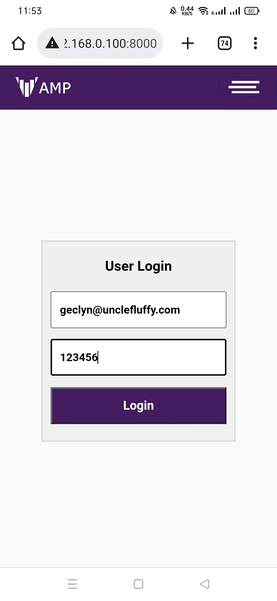
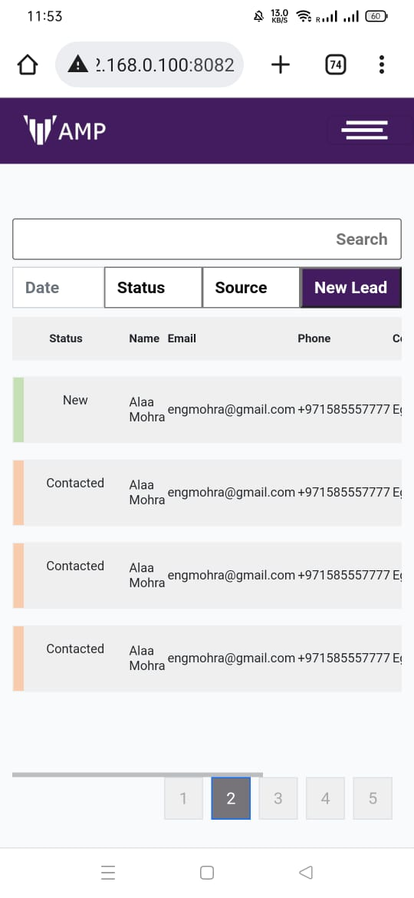
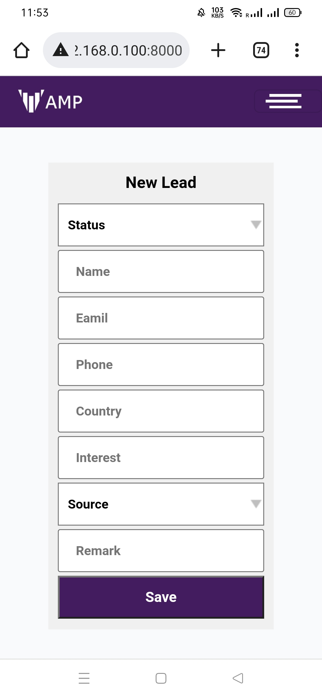

### Mobile
| 1                                                                           | 2                                                                           |
| --------------------------------------------------------------------------- | --------------------------------------------------------------------------- |
|  |  |
|  |  |

### checkonLive

https://amp.webhoster.tech/
or (some cloudflare isssue)
https://amp.vindians.xyz/

@ larvel Authentication ,
Authentication based on ppt

##Core

```php

Route::get('/', [Login::class, 'Index']);
Route::get('/Login', [Login::class, 'login'])->name('login');

Route::group(['prefix' => 'admin'], function () {
    // Routes that require authentication
    Route::group(['middleware' => 'admin'], function () {
        // Only authenticated users may enter...
        Route::get('/dashboard', [AdminController::class, 'Index']);
        Route::get('/newlead', [NewLeadController::class, 'Index'])->name('newlead');
        Route::get('/newlead/add', [NewLeadController::class, 'add'])->name('leadadd');
    });
});

```

### Create Table
php artisan migrate
### Create Seed datatable

php artisan make:seeder UsersTableSeeder

### Execute Datatable
php artisan db:seed
php artisan db:seed --class=UsersTableSeeder

### create model class
php artisan make:model source
### create create migration class
php artisan make:migration create_status_table --create=status


 ### List All Command


``` php artisan list```

``` Available commands:
  about                   Display basic information about your application
  clear-compiled          Remove the compiled class file
  completion              Dump the shell completion script
  db                      Start a new database CLI session
  docs                    Access the Laravel documentation
  down                    Put the application into maintenance / demo mode
  env                     Display the current framework environment
  help                    Display help for a command
  inspire                 Display an inspiring quote
  list                    List commands
  migrate                 Run the database migrations
  optimize                Cache the framework bootstrap files
  serve                   Serve the application on the PHP development server
  test                    Run the application tests
  tinker                  Interact with your application
  up                      Bring the application out of maintenance mode
 auth
  auth:clear-resets       Flush expired password reset tokens
 cache
  cache:clear             Flush the application cache
  cache:forget            Remove an item from the cache
  cache:prune-stale-tags  Prune stale cache tags from the cache (Redis only)
  cache:table             Create a migration for the cache database table
 config
  config:cache            Create a cache file for faster configuration loading
  config:clear            Remove the configuration cache file
 db
  db:monitor              Monitor the number of connections on the specified database
  db:seed                 Seed the database with records
  db:show                 Display information about the given database
  db:table                Display information about the given database table
  db:wipe                 Drop all tables, views, and types
 env
  env:decrypt             Decrypt an environment file
  env:encrypt             Encrypt an environment file
 event
  event:cache             Discover and cache the application's events and listeners
  event:clear             Clear all cached events and listeners
  event:generate          Generate the missing events and listeners based on registration
  event:list              List the application's events and listeners
 key
  key:generate            Set the application key
 lang
  lang:publish            Publish all language files that are available for customization     
 make
  make:cast               Create a new custom Eloquent cast class
  make:channel            Create a new channel class
  make:command            Create a new Artisan command
  make:component          Create a new view component class
  make:controller         Create a new controller class
  make:event              Create a new event class
  make:exception          Create a new custom exception class
  make:factory            Create a new model factory
  make:job                Create a new job class
  make:listener           Create a new event listener class
  make:mail               Create a new email class
  make:middleware         Create a new middleware class
  make:migration          Create a new migration file
  make:model              Create a new Eloquent model class
  make:notification       Create a new notification class
  make:observer           Create a new observer class
  make:policy             Create a new policy class
  make:provider           Create a new service provider class
  make:request            Create a new form request class
  make:resource           Create a new resource
  make:rule               Create a new validation rule
  make:scope              Create a new scope class
  make:seeder             Create a new seeder class
  make:test               Create a new test class
 migrate
  migrate:fresh           Drop all tables and re-run all migrations
  migrate:install         Create the migration repository
  migrate:refresh         Reset and re-run all migrations
  migrate:reset           Rollback all database migrations
  migrate:rollback        Rollback the last database migration
  migrate:status          Show the status of each migration
 model
  model:prune             Prune models that are no longer needed
  model:show              Show information about an Eloquent model
 notifications
  notifications:table     Create a migration for the notifications table
 optimize
  optimize:clear          Remove the cached bootstrap files
 package
  package:discover        Rebuild the cached package manifest
 queue
  queue:batches-table     Create a migration for the batches database table
  queue:clear             Delete all of the jobs from the specified queue
  queue:failed            List all of the failed queue jobs
  queue:failed-table      Create a migration for the failed queue jobs database table
  queue:flush             Flush all of the failed queue jobs
  queue:forget            Delete a failed queue job
  queue:listen            Listen to a given queue
  queue:monitor           Monitor the size of the specified queues
  queue:prune-batches     Prune stale entries from the batches database
  queue:prune-failed      Prune stale entries from the failed jobs table
  queue:restart           Restart queue worker daemons after their current job
  queue:retry             Retry a failed queue job
  queue:retry-batch       Retry the failed jobs for a batch
  queue:table             Create a migration for the queue jobs database table
  queue:work              Start processing jobs on the queue as a daemon
 route
  route:cache             Create a route cache file for faster route registration
  route:clear             Remove the route cache file
  route:list              List all registered routes
 sail
  sail:add                Add a service to an existing Sail installation
  sail:install            Install Laravel Sail's default Docker Compose file
  sail:publish            Publish the Laravel Sail Docker files
 sanctum
  sanctum:prune-expired   Prune tokens expired for more than specified number of hours        
 schedule
  schedule:clear-cache    Delete the cached mutex files created by scheduler
  schema:dump             Dump the given database schema
 session
  session:table           Create a migration for the session database table
 storage
  storage:link            Create the symbolic links configured for the application
 stub
  stub:publish            Publish all stubs that are available for customization
 vendor
  vendor:publish          Publish any publishable assets from vendor packages
 view
  view:cache              Compile all of the application's Blade templates
  view:clear              Clear all compiled view files ```
